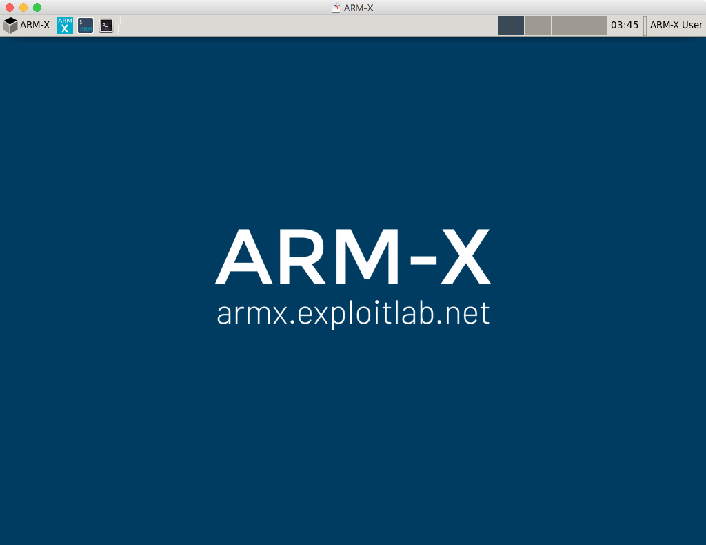
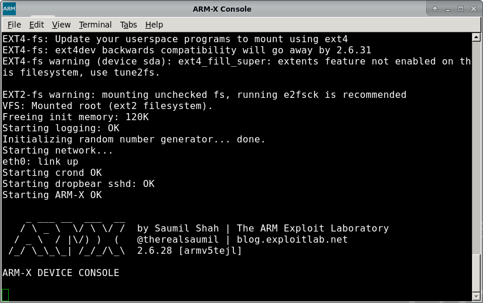
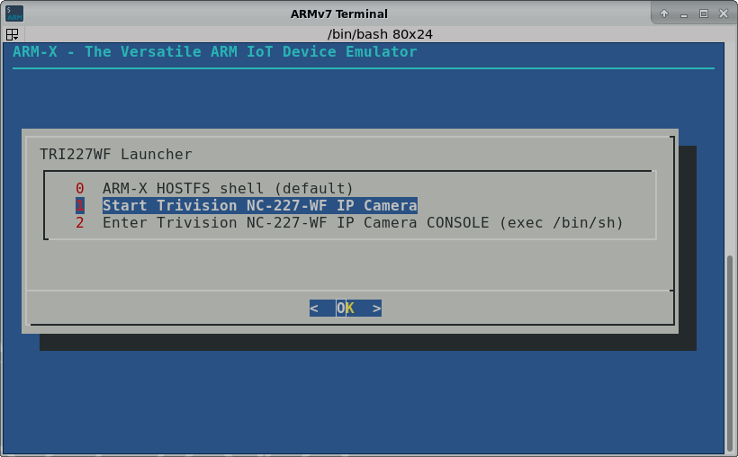
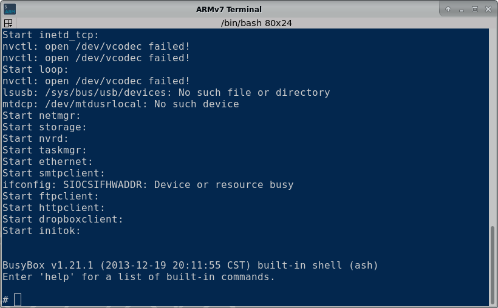
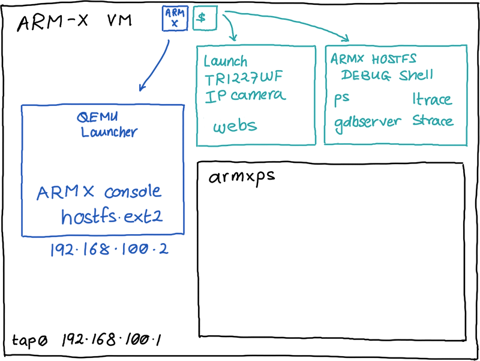
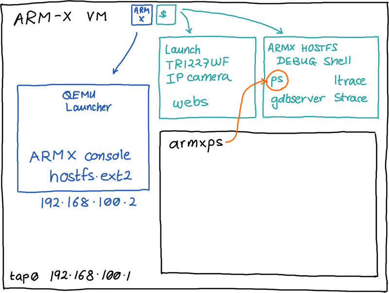

# Debugging With ARM-X

by Saumil Shah [@therealsaumil][saumil]

[saumil]: https://twitter.com/therealsaumil

November 2019

## TL;DR:

The ARM-X November 2019 VM contains updated tools and scripts to make debugging emulated IoT processes easy. No more fiddling around with `gdbserver` and GDB's `target remote`, `set sysroot` commands! One command to debug them all.


## An ARM-X Debugging Tutorial

The ARM-X Firmware Emulation Framework contains essential tools and utilities to statically and dynamically analyse emulated IoT targets. Here, we shall see how to use `gdb` to debug a process running on an emulated IoT target. We shall use the **ARM-X November 2019 VM** and debug the web server running on the **Trivision NC-227-WF IP Camera** as an example.

## 1. Start the ARM-X Virtual Machine



## 2. Start the Trivision IP Camera

Click the ARM-X Launcher icon on the top toolbar and select the **Trivision NC-227-WF IP Camera**:


The ARM-X launcher invokes QEMU and boots the kernel registered with the IP Camera, mounts `hostfs.ext2` and shows the ARM-X console.



## 3. "Boot up" the IP Camera in ARM-X

Click on the ARM-X Terminal icon next to the launcher icon on the top toolbar. Select the option **Start Trivision NC-227-WF IP Camera**.



The IP Camera's `init` scripts will now be started and eventually all its system and application services will be running.



## 4. Start the ARM-X HOSTFS Debug Shell (Optional)

Clicking on the ARM-X Terminal icon again will invoke the **ARM-X HOSTFS DEBUG Shell**. This shell allows you to run commands to view running processes, inspect a process' virtual memory map, run utilities like `objdump`, `strace`, `ltrace`, etc.

At this point, the emulated IP Camera is ready to be analysed.


## 5. Enumerating processes on the emulated device

The `/armx/run` directory contains a few scripts to enable easy enumeration of the device's processes and also attach a debugger to a device process. `/armx/run` is present in the `$PATH` on the ARM-X VM.

Open a new terminal on the VM and run `armxps`:



```
armx:/armx/run$ ./armxps
  PID TTY      STAT   TIME COMMAND
    1 ?        Ss     0:00 init      
    2 ?        S<     0:00 [kthreadd]
    3 ?        S<     0:00 [ksoftirqd/0]
    4 ?        S<     0:00 [watchdog/0]
    5 ?        S<     0:00 [events/0]
    6 ?        S<     0:00 [khelper]
    9 ?        S<     0:00 [async/mgr]
  105 ?        S<     0:00 [kblockd/0]
  112 ?        S<     0:00 [kseriod]
  118 ?        S<     0:00 [kmmcd]
  143 ?        S      0:00 [khungtaskd]
  144 ?        S      0:00 [pdflush]
  145 ?        S      0:00 [pdflush]
  146 ?        S<     0:00 [kswapd0]
  147 ?        S<     0:00 [aio/0]
  148 ?        S<     0:00 [nfsiod]
  300 ?        S<     0:00 [scsi_eh_0]
  324 ?        S<     0:00 [mtdblockd]
  332 ?        S<     0:00 [kpsmoused]
  367 ?        S<     0:00 [rpciod/0]
  385 ?        Ss     0:00 /sbin/syslogd -m 0
  387 ?        Ss     0:00 /sbin/klogd
  409 ?        Ss     0:00 /usr/sbin/dropbear
  413 ttyAMA0  Ss+    0:00 /sbin/agetty -p -L ttyAMA0 115200 vt100
  414 ?        Ss     0:01 /usr/sbin/dropbear
  415 pts/0    Ss     0:00 -sh
  430 pts/0    S      0:00 /bin/bash ./run-init
  441 pts/0    S      0:00 /bin/sh /etc/armxinit
  465 ?        Ss     0:00 syslogd
  467 ?        Ss     0:00 klogd
  480 pts/0    S      0:00 nvctl
  482 pts/0    S      0:00 inetd_tcp
  493 pts/0    S      0:00 netmgr
  498 pts/0    S      0:00 storage
  501 pts/0    S      0:00 nvrd
  507 pts/0    S      0:00 httpclient -c /var/config/httpclient_task15.conf
  510 pts/0    S      0:00 taskmgr
  511 pts/0    S+     0:00 /bin/sh
  538 pts/0    S      0:00 ndcpd
  540 pts/0    S      0:00 ndcpd2
  542 pts/0    S      0:00 ndcpd3
  547 pts/0    S      0:00 upnpd eth0
  550 pts/0    S      0:00 upnpd eth0
  551 pts/0    S      0:00 upnpd eth0
  552 pts/0    S      0:00 upnpd eth0
  554 pts/0    S      0:00 upnpd eth0
  556 pts/0    S      0:00 webs
  557 pts/0    S      0:00 upnpd eth0
  559 pts/0    S      0:00 upnpd eth0
  560 pts/0    S      0:00 upnpd eth0
  562 pts/0    S      0:00 onvifn
  564 pts/0    S      0:00 onvifd
  567 pts/0    S      0:00 ipcamd
  569 pts/0    S      0:00 ipcamd
  571 pts/0    S      0:00 ipcamd
  572 ?        Ss     0:01 /usr/sbin/dropbear
  575 ?        R      0:00 ps ax
```

Internally, `armxps` invokes `ssh` and runs a process enumeration command on the emulated device accessible at `192.168.100.2`. You can perform the same task by invoking the ARM-X HOSTFS Debug Shell and running the `ps` command within it, however `armxps` makes the task easier.



## 6. Debugging the Web Server

We will now invoke `gdb` and attach it to the `webs` process running in QEMU. We need a cross platform GDB that runs on an x86 host and is capable of debugging ARM targets. The ARM-X VM's host system has `arm-linux-gnueabi-gdb` installed in it.

The typical process would involve invoking the ARM-X HOSTFS Debug Shell, running `gdbserver :5000 --attach $(pidof webs)` and then invoking `arm-linux-gnueabi-gdb` and connecting to the remot target using:

```
target remote 192.168.100.2:5000
set sysroot target:/armx/TRI227WF/rootfs
```

The `set sysroot` command is important for GDB to find the proper binaries for symbol resolution, since the IP Camera's binaries are running inside a `chroot` jail.

However, all this is made easy using `/armx/run/armxgdb`. `armxgdb` launches `arm-linux-gnueabi-gdb`, and internally invokes `ssh` to launch `gdbserver` on `192.168.100.2`. The remote debugging is enabled using STDIN to the SSH connection!


```
armx:/armx/run$ ./armxgdb webs
Remote debugging using | ssh -T root@192.168.100.2 gdbserver - --attach \`pidof webs\`
Attached; pid = 556
Remote debugging using stdio
Reading /armx/TRI227WF/rootfs/usr/bin/webs from remote target...
warning: File transfers from remote targets can be slow. Use "set sysroot" to access files locally instead.
Reading /armx/TRI227WF/rootfs/usr/bin/webs from remote target...
Reading symbols from target:/armx/TRI227WF/rootfs/usr/bin/webs...(no debugging symbols found)...done.
Reading /lib/libgcc_s.so.1 from remote target...
warning: .dynamic section for "target:/lib/libgcc_s.so.1" is not at the expected address (wrong library or version mismatch?)
Reading /lib/libc.so.0 from remote target...
warning: .dynamic section for "target:/lib/libc.so.0" is not at the expected address (wrong library or version mismatch?)
Reading /lib/ld-linux.so.3 from remote target...
Error while mapping shared library sections:
Could not open `target:/lib/ld-linux.so.3' as an executable file: No such file or directory
Reading symbols from target:/lib/libgcc_s.so.1...(no debugging symbols found)...done.
Reading symbols from target:/lib/libc.so.0...(no debugging symbols found)...done.
Reading /lib/ld-linux.so.3 from remote target...
warning: Unable to find dynamic linker breakpoint function.
GDB will be unable to debug shared library initializers
and track explicitly loaded dynamic code.
0x4002f8c4 in ?? () from target:/lib/libc.so.0
Reading /armx/TRI227WF/rootfs/lib/libgcc_s.so.1 from remote target...
Reading /armx/TRI227WF/rootfs/lib/libgcc_s.so.1 from remote target...
Reading symbols from target:/armx/TRI227WF/rootfs/lib/libgcc_s.so.1...done.
Reading /armx/TRI227WF/rootfs/lib/libc.so.0 from remote target...
Reading /armx/TRI227WF/rootfs/lib/libc.so.0 from remote target...
Reading symbols from target:/armx/TRI227WF/rootfs/lib/libc.so.0...done.
Reading /armx/TRI227WF/rootfs/lib/ld-linux.so.3 from remote target...
Reading /armx/TRI227WF/rootfs/lib/ld-linux.so.3 from remote target...
Reading symbols from target:/armx/TRI227WF/rootfs/lib/ld-linux.so.3...(no debugging symbols found)...done.
Reading /armx/TRI227WF/rootfs/lib/ld-linux.so.3 from remote target...
(gdb)
```

Now, you can go about debugging `webs` as you wish.

```
(gdb) info registers 
r0             0xfffffdfe	4294966782
r1             0x40083c88	1074281608
r2             0x40083ca0	1074281632
r3             0x40083cb8	1074281656
r4             0xbefffa68	3204446824
r5             0x1	1
r6             0x40083ca0	1074281632
r7             0x8e	142
r8             0x40083cb8	1074281656
r9             0x4007a7a0	1074243488
r10            0x0	0
r11            0x4	4
r12            0x61068	397416
sp             0xbefffa38	0xbefffa38
lr             0x43cf0	277744
pc             0x4002f8c4	0x4002f8c4 <select+16>
cpsr           0x60000010	1610612752
```

```
(gdb) info proc mappings 
process 556
Mapped address spaces:

	Start Addr   End Addr       Size     Offset objfile
	    0x8000    0x59000    0x51000        0x0 /armx/TRI227WF/rootfs/usr/bin/webs
	   0x60000    0x61000     0x1000    0x50000 /armx/TRI227WF/rootfs/usr/bin/webs
	   0x61000    0x65000     0x4000    0x51000 /armx/TRI227WF/rootfs/usr/bin/webs
	   0x65000    0x78000    0x13000        0x0 [heap]
	0x40000000 0x40005000     0x5000        0x0 /armx/TRI227WF/rootfs/lib/ld-uClibc-0.9.30.2.so
	0x40005000 0x40006000     0x1000        0x0 
	0x4000c000 0x4000d000     0x1000     0x4000 /armx/TRI227WF/rootfs/lib/ld-uClibc-0.9.30.2.so
	0x4000d000 0x4000e000     0x1000     0x5000 /armx/TRI227WF/rootfs/lib/ld-uClibc-0.9.30.2.so
	0x4000e000 0x40018000     0xa000        0x0 /armx/TRI227WF/rootfs/lib/libgcc_s.so.1
	0x40018000 0x4001f000     0x7000        0x0 
	0x4001f000 0x40020000     0x1000     0x9000 /armx/TRI227WF/rootfs/lib/libgcc_s.so.1
	0x40020000 0x40021000     0x1000     0xa000 /armx/TRI227WF/rootfs/lib/libgcc_s.so.1
	0x40021000 0x4006b000    0x4a000        0x0 /armx/TRI227WF/rootfs/lib/libuClibc-0.9.30.2.so
	0x4006b000 0x40072000     0x7000        0x0 
	0x40072000 0x40073000     0x1000    0x49000 /armx/TRI227WF/rootfs/lib/libuClibc-0.9.30.2.so
	0x40073000 0x40074000     0x1000    0x4a000 /armx/TRI227WF/rootfs/lib/libuClibc-0.9.30.2.so
	0x40074000 0x400f9000    0x85000        0x0 
	0xbefeb000 0xbf000000    0x15000        0x0 [stack]
```

## Links

ARM-X Home Page: https://armx.exploitlab.net/

VMWare VM: https://app.box.com/s/3iyi5f6vpakngh8ti3ir2zzukgdu0j2q

Github: https://github.com/therealsaumil/armx/

*[@therealsaumil][saumil]*

[saumil]: https://twitter.com/therealsaumil
